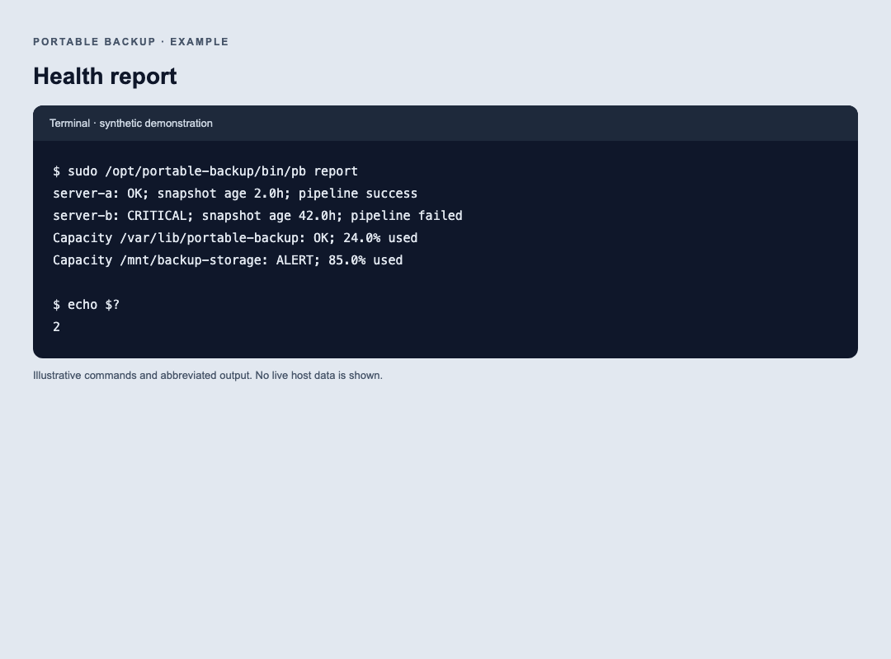
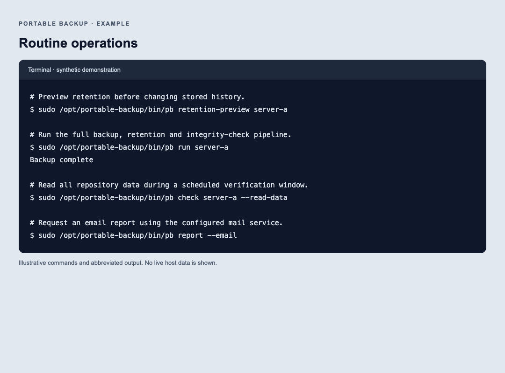
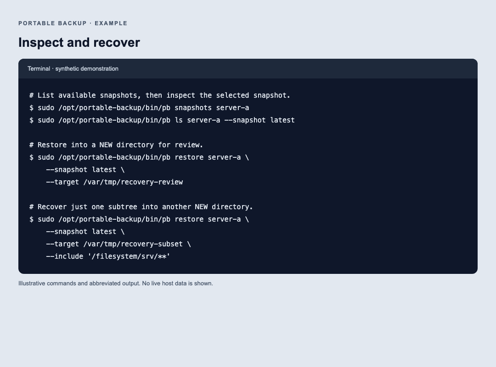
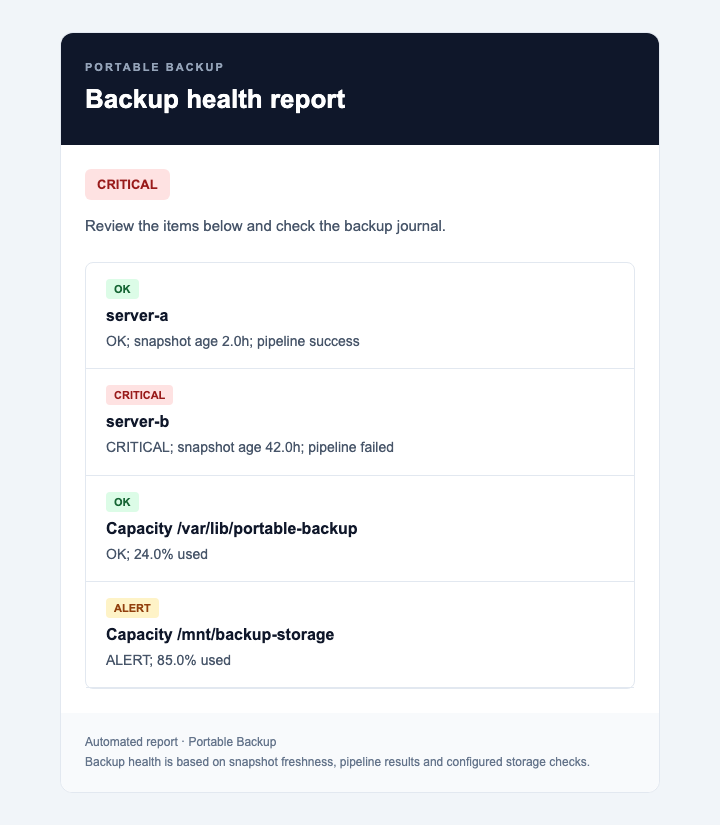

# Example screens

All values are synthetic. CLI screens illustrate commands and abbreviated output, not evidence of a production run. No real identities, snapshot IDs, timestamps or infrastructure data are included.

## CLI health report

[Copyable transcript](cli-report.txt) · [HTML version](cli-report.html)

The report returns 2 when any check is critical. Email requires a configured recipient and mail service.

## Backup and maintenance

[Copyable transcript](cli-operations.txt) · [HTML version](cli-operations.html)

Successful `run` output is abbreviated to its final line. Restic normally also prints progress and repository information.

## Restore workflow

[Copyable transcript](cli-restore.txt) · [HTML version](cli-restore.html)

Listing output is intentionally omitted to avoid presenting invented snapshot IDs. Always inspect your own snapshots and use a new restore destination.

## HTML email report

[Open or download the HTML email example](email-report.html). On GitHub, download the HTML file and open it locally to see the rendered version.

This preview is generated by the actual email renderer. It demonstrates a mixed-status report with overall CRITICAL severity. Its appearance in individual email clients may vary.

## Regenerate

Run `python3 docs/examples/generate.py` from the repository root to rebuild the synthetic HTML pages and transcripts. This does not run backup commands, access repositories or send email. Open those local HTML files in a browser to inspect them and capture replacement PNG screens when changing the layout. Current PNGs were captured with Chromium at 1080 pixels wide for CLI screens and 720 pixels wide for email, then visually inspected.
