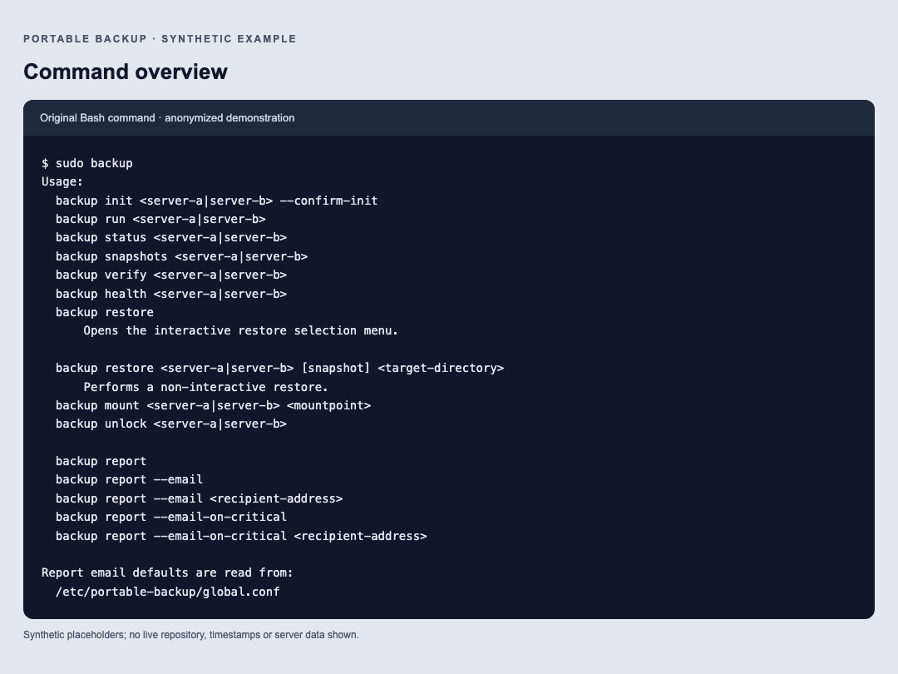

# Original command and email examples

These examples replace the reconstruction's `pb` screens. Values are synthetic; no real snapshot IDs, timestamps, server data or mail messages are included.

## Command overview

[Copyable usage](cli-usage.txt). This text comes directly from the shipped usage function.

## Interactive restore

[Transcript](cli-restore.txt). The illustrated first menu and cancellation match the original function, exercised separately through a pseudo-terminal test. After host selection, the full original implementation continues to snapshot selection, directory browsing, restore summary and confirmation.

## Report

[Text report](cli-report.txt). This uses the original report generator with synthetic storage/host inputs. Actual runtime output includes the operator's private snapshot IDs, paths and timestamps.

## Original HTML email

[HTML email example](email-report.html). Download and open locally to see rendered HTML. This is generated by the actual Bash `send_report_email` function, with sendmail replaced by a local capture function. No email is sent. It preserves the original storage bar and full-report panel. Its appearance can vary among email clients.

Run `python3 docs/examples/generate.py` to rebuild HTML and text without accessing any server. The generator uses test helpers to isolate the original functions. PNGs were rendered in Chromium and visually inspected. To refresh them, capture the local HTML pages at 1080 pixels wide for CLI screens and 720 pixels wide for email.
